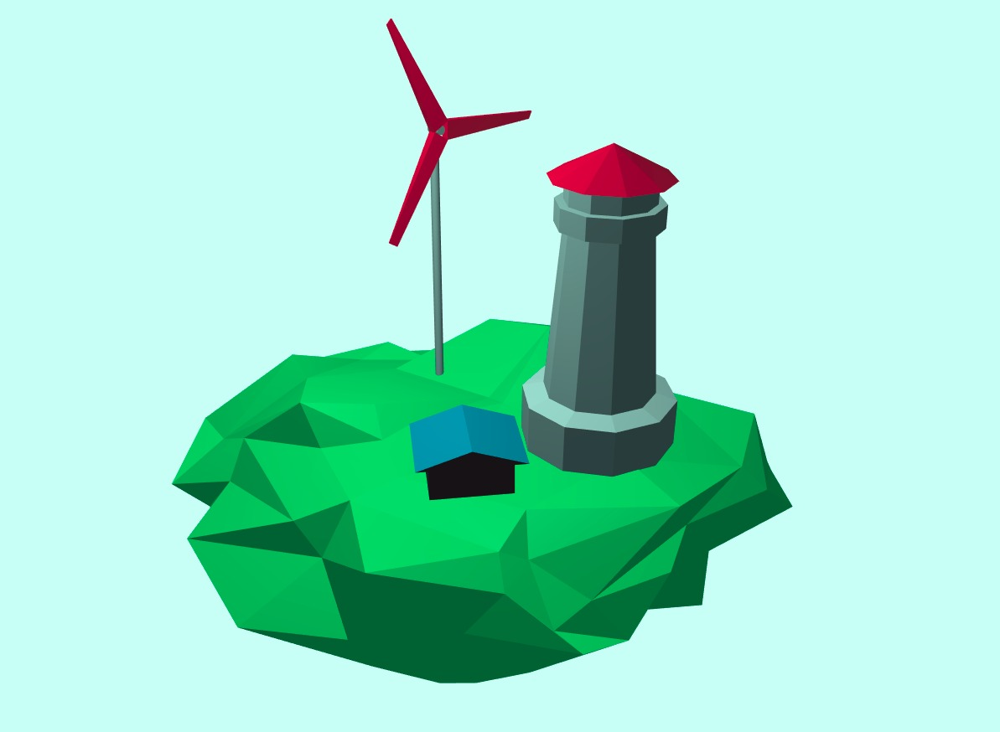

# Low Poly WebGL Island

Zero-dependency experiment with pure WebGL.  
Sample [Phong BRDF](https://en.wikipedia.org/wiki/Phong_reflection_model) implementation.

Modelled in Blender, exported with [assimp2json](https://github.com/acgessler/assimp2json)

[Live Demo](https://nairinarinyan.github.io/low-poly-island/)

